# Multiscale Facial Expression Recognition Based on Dynamic Global and Static Local Attention
Authors: Jie Xu; Yang Li; Guanci Yang; Ling He; Kexin Luo

<div align=center>
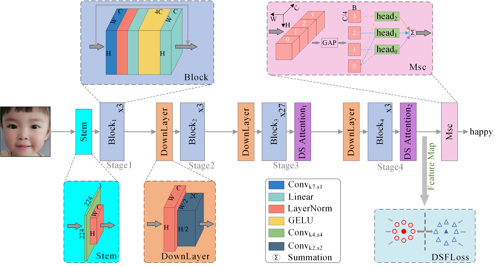


Fig. 1 Architecture of Multiscale Facial Expression Recognition based on Dynamic Global and Static Local Attention
</div>


<div align=center>
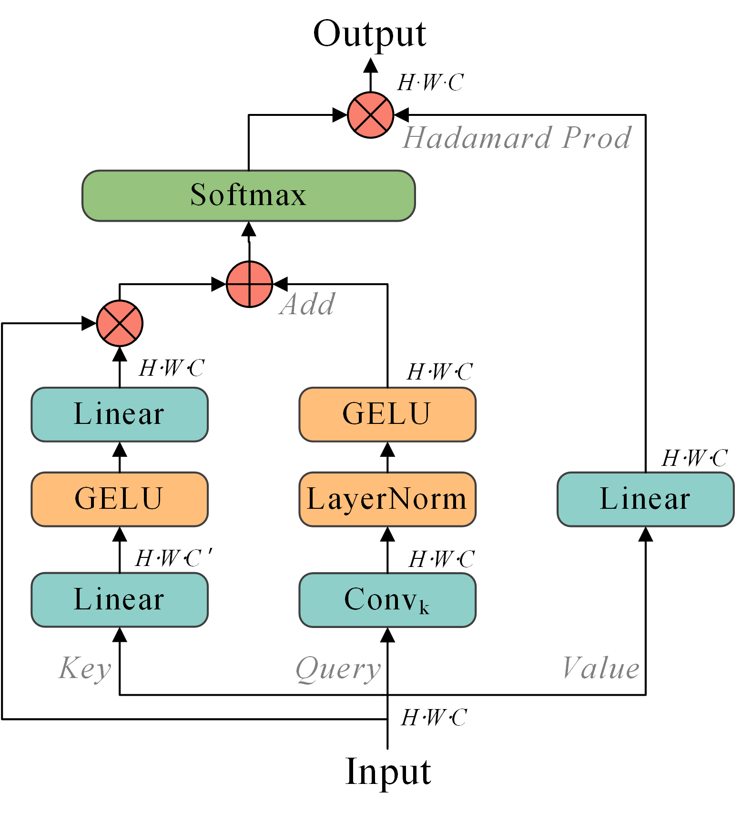


Fig. 2 Architecture of Dynamic Global and Static Local Attention
</div>


## 1、Preparation
- Download pre-trained model of [MSCeleb](https://drive.google.com/file/d/1H421M8mosIVt8KsEWQ1UuYMkQS8X1prf/view?usp=sharing).
- Download [RAF-DB](http://www.whdeng.cn/raf/model1.html) dataset and extract the `raf-basic` dir to `./datasets`.
- Download [AffectNet](http://mohammadmahoor.com/affectnet/) dadtaset and extract the `AffectNet` dir to `./datasets`.
- Then `preprocess` the datasets as follow:
## 2、Data preparation:
- We use the face alignment codes in [face.evl](https://github.com/ZhaoJ9014/face.evoLVe/#Face-Alignment) to align face images first.
- the `aligned` face struct as follow:
```
  - data/raf-db/
		 train/
		     train_00001_aligned.jpg	# aligned by MTCNN
		     train_00002_aligned.jpg	# aligned by MTCNN
		     ...
		 valid/
		     test_0001_aligned.jpg	# aligned by MTCNN
		     test_0002_aligned.jpg	# aligned by MTCNN
		     ...
 ```

## 3、Note:
the remain file or code (DSF Loss function and the pretrained ConvNext model on Ms-Celeb-1M dataset will release after the paper was accepted)

## 4、Training

```
CUDA_VISIBLE_DEVICES=0 python train.py --help
```

## 5、Models
Pre-trained models can be downloaded for evaluation as following:

|   dataset   |   accuracy  |    weight   |
|:-----------:|:-----------:|:-----------:|
|  `RAF-DB`   | `92.08`     |`Coming soon`|
| `AffectNet-8` | `63.15`    |`Coming soon`|
| `AffectNet-7` | `67.06`    |`Coming soon`|
|    `FERPlus`  | `91.09`    |`Coming soon`|

## 6、Data distribution of RAF-DB
<div align=center>
Baseline model for data distribution on RAF-DB
</div>

<div align=center>
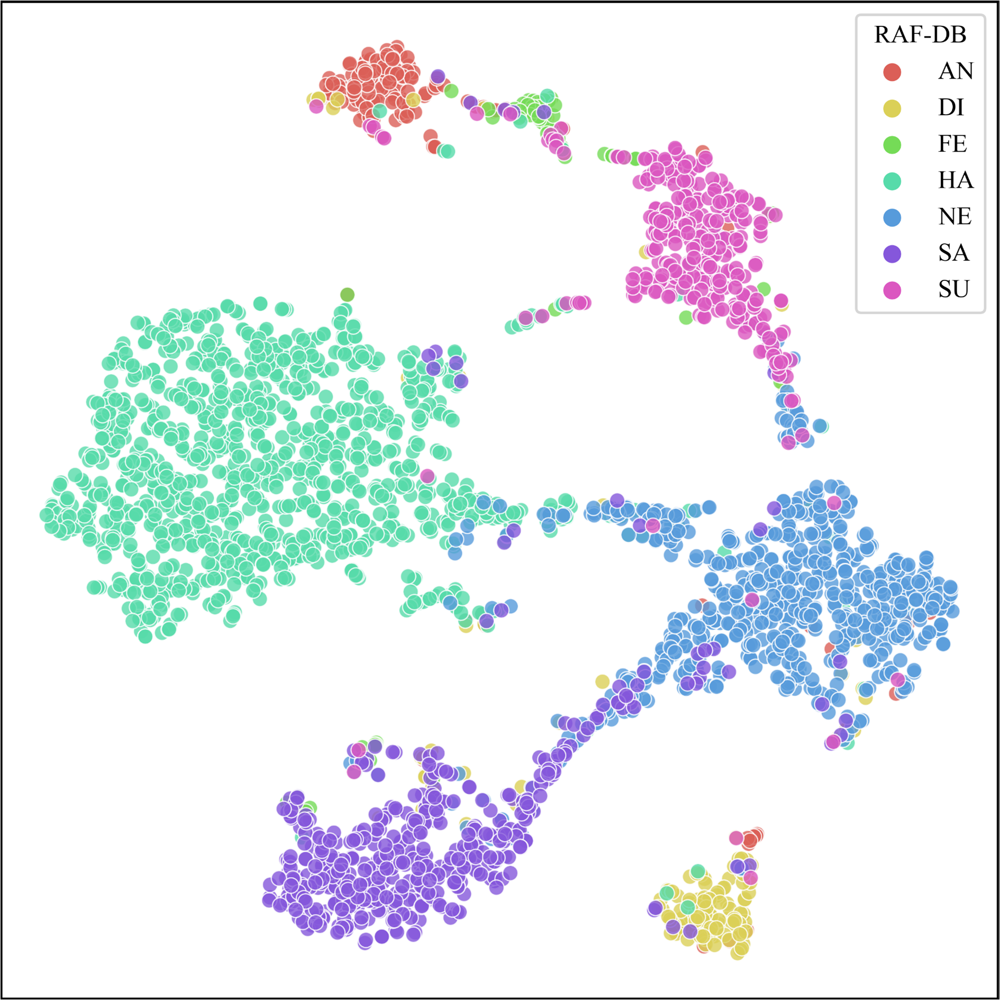
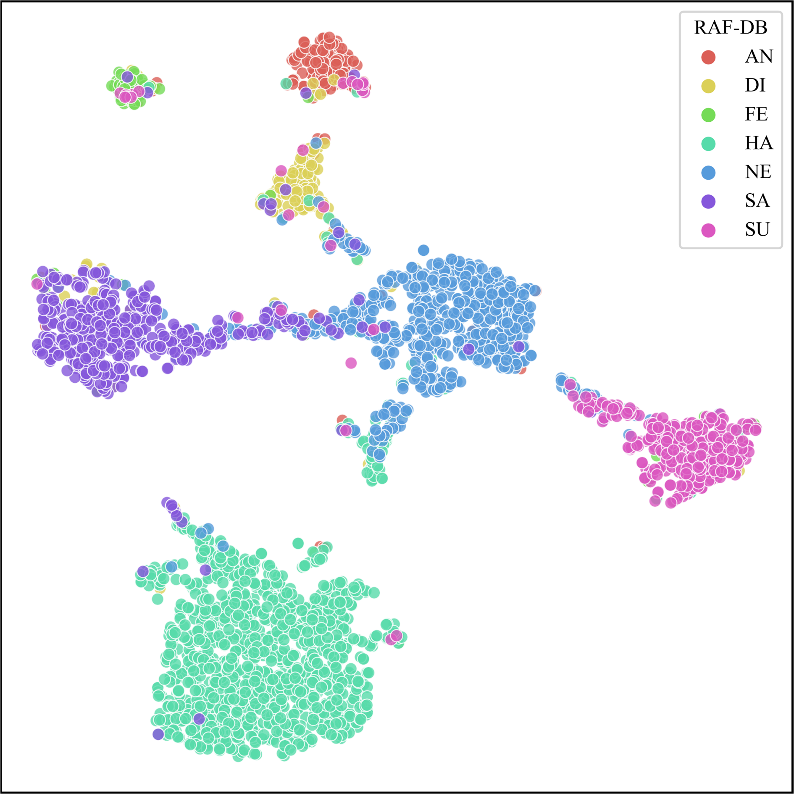
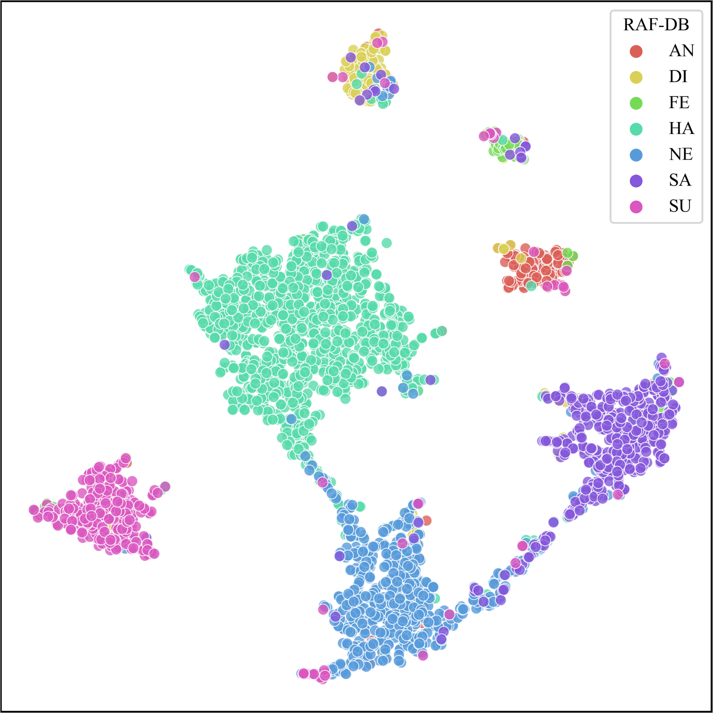


Fig. 3(a) w/o Feature Loss 	\;	(b) w LGM Loss 	\;	(c) w DSF Loss
</div>

<div align=center>
MFER model for data distribution on RAF-DB
</div>
<div align=center>
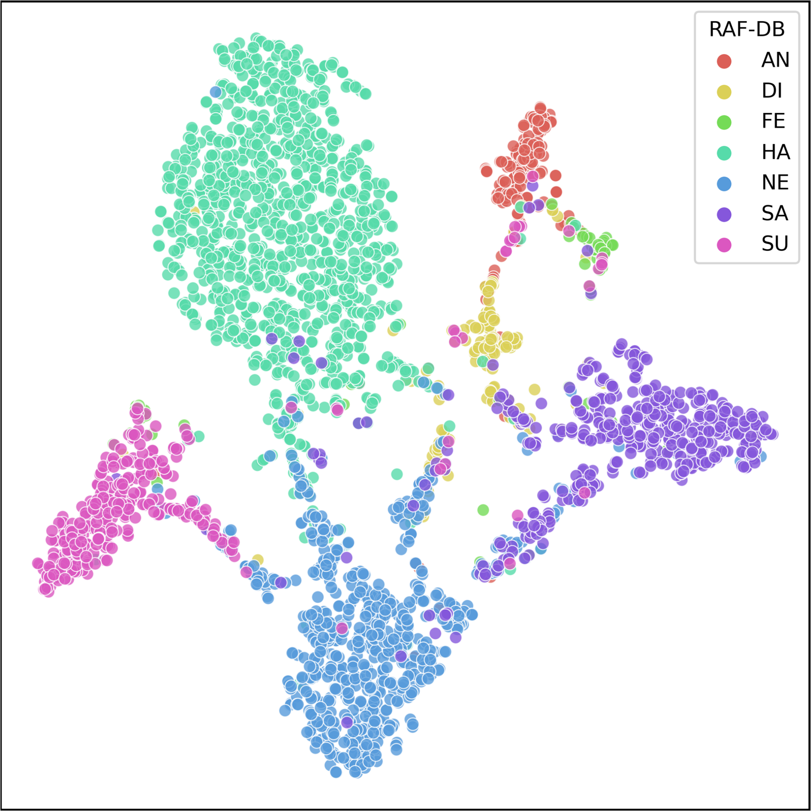
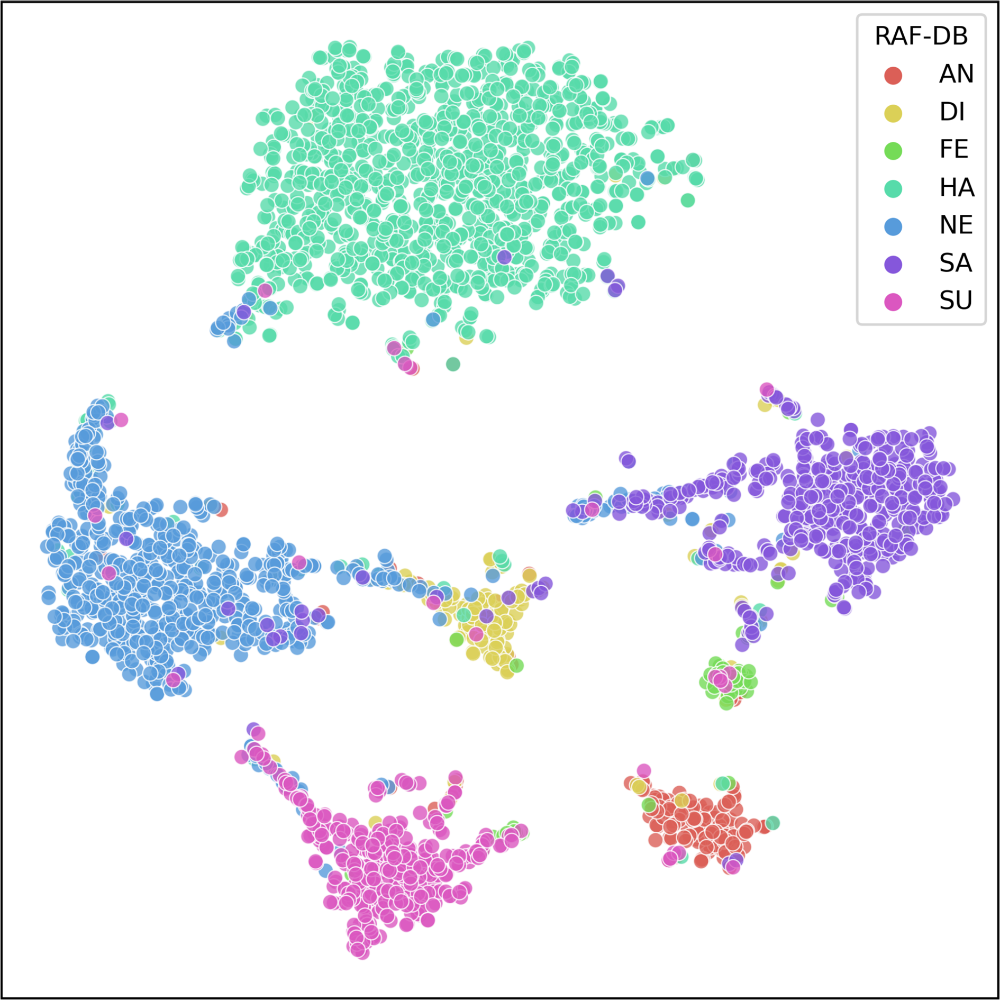
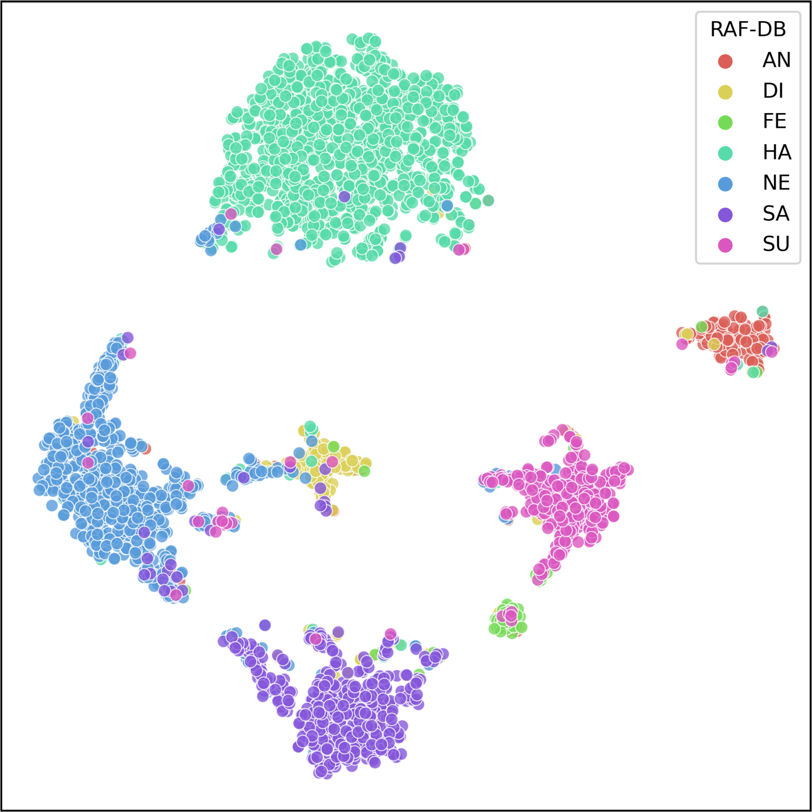


Fig. 4(a) w/o Feature Loss 	\;	(b) w LGM Loss 	\;	(c) w DSF Loss
</div>


## 7、Confusion Matrices for MFER
<div align=center>
Confusion Matrices for MFER on RAF-DB, AffectNet-7, AffectNet-8 and FERPlus
</div>
<div align=center>
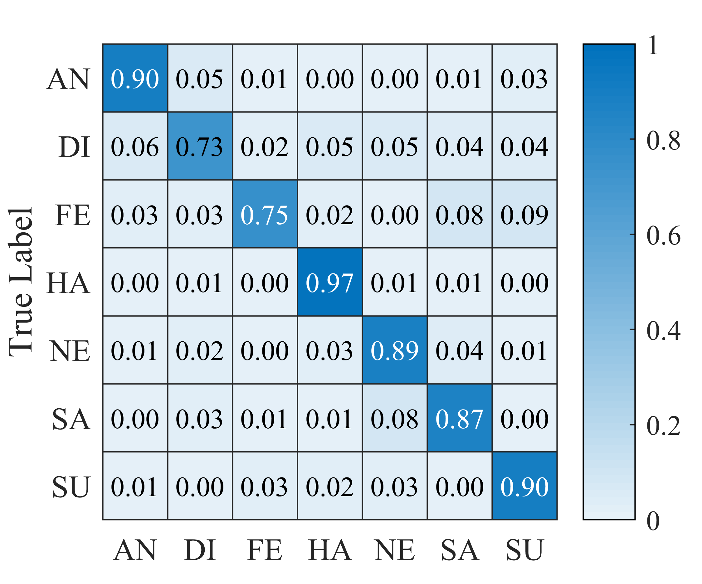
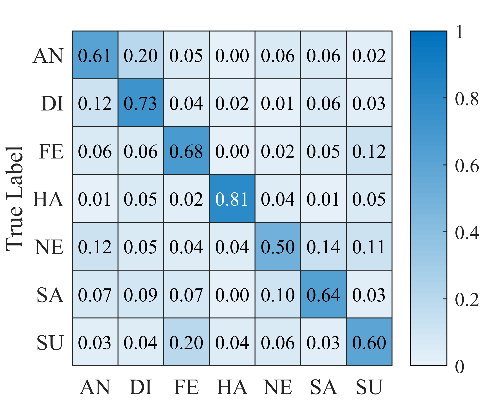
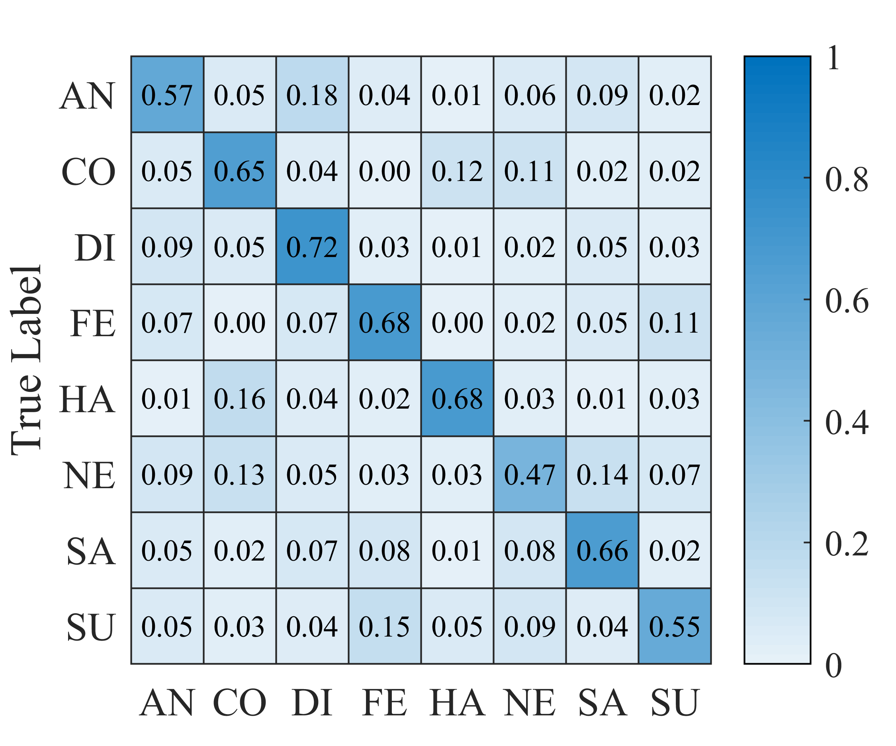


Fig. 7(a) RAF-DB 	\;	(b) AffectNet-7 	\;	(c) AffectNet-7 	\;	(d) FERPlus 
</div>


## 8、Grad_CAM of different expressions on some examples face from RAF-DB dataset
<div align=center>
Grad-CAM for MFER on RAF-DB dataset
</div>
<div align=center>


Fig. 8 Grad-CAM
</div>


## License
Our research code is released under the MIT license. See [LICENSE](./LICENSE) for details.


And the remain file or code will release soon!!!!!!


## Reference
you may want to cite:
```
@ARTICLE{10678884,
  title={Multiscale Facial Expression Recognition Based on Dynamic Global and Static Local Attention}, 
  author={Xu, Jie and Li, Yang and Yang, Guanci and He, Ling and Luo, Kexin},
  journal={IEEE Transactions on Affective Computing}, 
  year={2024},
  volume={},
  number={},
  pages={1-14},
  doi={10.1109/TAFFC.2024.3458464}}
```


## Acknowledgement
Thanks for the code of the following:\
[ConvNext](https://github.com/facebookresearch/ConvNeXt.) and 
[WZMIAOMIAO](https://github.com/WZMIAOMIAO/deep-learning-for-image-processing)

