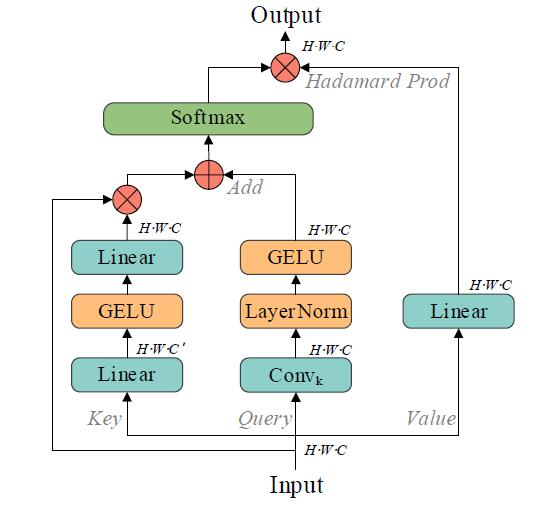
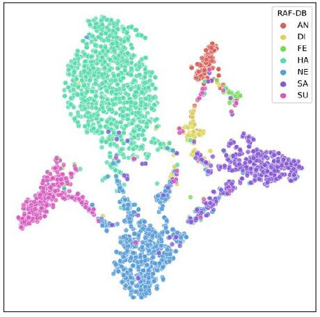
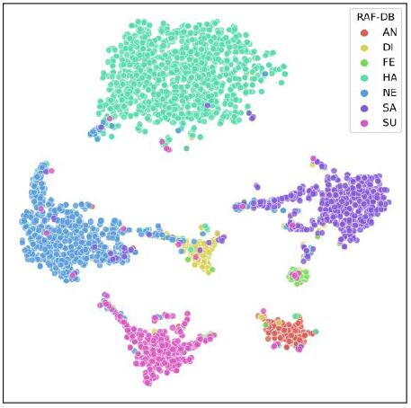
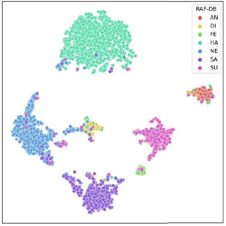

# Multiscale Facial Expression Recognition Based on Dynamic Global and Static Local Atention

<div align=center></div>

Architecture of Multi-scale Facial expression Recognition (MFER) model based on DS attention

\
Architecture of DS attention


## Preparation
- Download pre-trained model of [MSCeleb](https://drive.google.com/file/d/1H421M8mosIVt8KsEWQ1UuYMkQS8X1prf/view?usp=sharing).
- Download [RAF-DB](http://www.whdeng.cn/raf/model1.html) dataset and extract the `raf-basic` dir to `./datasets`


## Training
We will provide the training code for RAF-DB.

```
CUDA_VISIBLE_DEVICES=0 Coming soon.
```

## Models
Pre-trained models can be downloaded for evaluation as following:

|     dataset 	| accuracy 	| ckpt 	|
|:-----------:	|:--------:	|:----:	|
|    `RAF-DB`   	| `92.08`    	|`Coming soon`|
| `AffectNet-8` 	| `63.15`    	|`Coming soon`|
| `AffectNet-7` 	| `67.06`       |`Coming soon`|
|    `FERPlus`   	| `91.09`    	|`Coming soon`|

## Data distribution of RAF-DB
\
w/o Feature Loss\
\
w LGM Loss\
\
w DSF Loss


## License
Our research code is released under the MIT license. See [LICENSE](./LICENSE) for details.


## Grad CAM++ Reproduction
Thanks for the code of the following:\
https://github.com/facebookresearch/ConvNeXt
